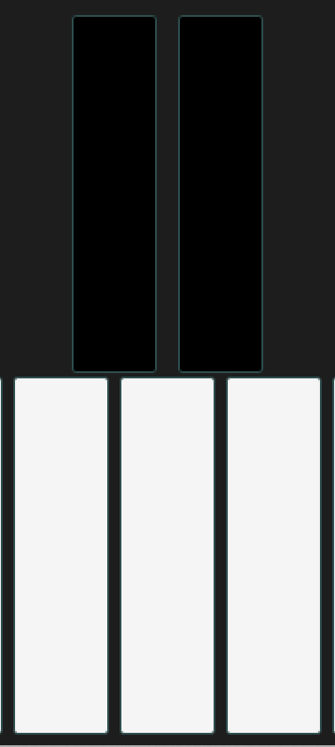

Touchbox
========

## Overview

This is a prototype of a music app for Windows 8.1, the purpose of which was to function as a demo app for a pressure sensitive touch screen. For a couple of reasons I never finished the app. The code that is in this repo (mostly) works, it's just not very interesting. :-) 

### Reason number one (for ditching the app)

Sound problems. I had never really worked with “serious” sound programming before, and with C#/.NET as the platform of choice - well, at least for me I sensed a lack of good audio code to build on there. 

My first attempt was to just send MIDI to the internal sound source, but that turned out to have a latency that rendered it almost useless. 

I also checked out various C libraries, e.g. libpd, but frankly, at that point I felt that I already had put way too much work into this (it was meant to be a quick little side project over a christmas vacation). 

Finally I found NAudio, a really great .NET library for making sounds. For some reason I had gotten additive synthesis in my head. I had never worked with that before, but I thought it could make for interesting timbre changes with pressure changes, timbre changes that would probably be rather easy to achieve, or so I hoped. So, I whipped something together, and it wasn't half bad, but then I tweaked some, and it got worse, and I think a lesson learned was that I didn't really have a good intuitive sense of *what* to tweak, and how much. And then there was the deadline approaching, so I left it as it was.

Which probably was a good thing, for up until then I had developed it as a regular Windows desktop app, but when I created a Windows Store App with that code, I learned that NAudio wasn't really there yet, so I had to spend some more time on solving that, finding an inofficial release and pulling the missing pieces in as source code as well. 

### Reason number two (for ditching the app)

The idea to make somthing music based came early in the discussions, but after working with this for a while I realized that it was a wrong path, at least for me. Maybe music could be a good match for this pressure sensitive screen, but not in this form. Maybe in a more playful form, like for instance the Electroplankton series for Nintendo DS.

So, I decided to scrap it. 
But, some of the sound work ended up in the other demo I did for the same company, a game-like app with no real purpose: Bubbles. No real purpose, but I still think it works better as a demo in this context. 

## Video
[Exclusive video footage of the demo.](https://youtu.be/Al08G2LbwVo)

The first sound is the internal sound source. The second sound is the homebrew additive synthesis. 
